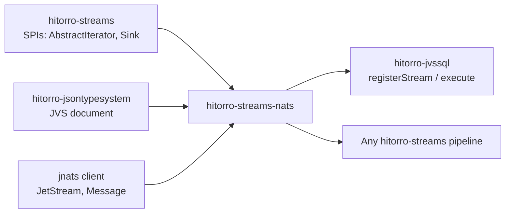

# hitorro-streams-nats

NATS JetStream source (`Iterator<JVS>` / `Iterator<Message>`) and sink
(`Sink<JsonNode>`) for the
[hitorro-streams](https://github.com/geekychris/hitorro-streams) pipeline
framework. Uses `io.nats:jnats` (pull subscriptions).

## Position



Depends on `hitorro-core` + `hitorro-streams` + `hitorro-jsontypesystem` +
`io.nats:jnats`. Uses pull subscriptions with durable consumers so restarts
resume from the last acked message.

## Quick example

```java
import com.hitorro.streams.nats.NatsJetStreamSource;
import com.hitorro.streams.nats.NatsJetStreamSink;
import com.hitorro.jvssql.JvsSqlEngine;
import java.time.Duration;

try (NatsJetStreamSource src = NatsJetStreamSource.builder()
        .url("nats://localhost:4222")
        .stream("EVENTS")
        .subject("events.>")           // any subject under events.
        .durableName("my-app")         // reused across restarts
        .batchSize(100)
        .fetchTimeout(Duration.ofSeconds(1))
        .build()) {

    JvsSqlEngine engine = JvsSqlEngine.builder()
        .registerStream("events", src.asJvsIterator(), eventType)
        .build();

    NatsJetStreamSink out = NatsJetStreamSink.builder()
        .url("nats://localhost:4222")
        .subjectExtractor(row -> "enriched." + row.path("dept").asText())
        .async(true)                    // publishAsync + await on stop()
        .build();

    engine.compile("""
        SELECT dept, COUNT(*) AS n, SUM(bytes) AS total
        FROM events
        GROUP BY dept
        """).execute(out);
}
```

## Building

```bash
# from reactor root
mvn install -DskipTests -pl hitorro-streams-nats -am
```

Java 21 required.

## Notes

- **Delivery** — pull-based subscription; each fetch batch is bounded by
  `batchSize` and `fetchTimeout`. `asJvsIterator()` auto-acks after
  successful parse+emit; unparseable messages are nak'd so the server can
  redeliver per your consumer config.
- **Durable consumers** — `durableName` makes the server track offset across
  restarts. Omit it for an ephemeral consumer that starts from `deliverPolicy`
  each run.
- **Sink modes** — sync `publish` (default, safest for at-least-once) vs
  `async(true)` with `publishAsync` + drain-on-stop (higher throughput; some
  acks may be lost if the broker crashes between publish and stop).
- **Per-row subjects** — `subjectExtractor(row -> ...)` computes the subject
  from row content, useful for topic-tree routing.
- **Shutdown** — `close()` on the source unsubscribes and closes the
  connection cleanly.

## License

MIT (see the parent `hitorro-all` repo).
